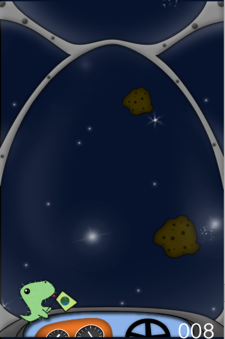

# Meteor Miner
## Description
Tap, tap, tap. Destroy those pesky meteors one by one to gain points. BUT WAIT, watch-out! Some may just destroy your oxygen levels. Xcode mobile app.

# General
## Running/Viewing (Simulation)/Building
for development; takes IOS or Android simulator

## Note:
- Some code files (Resources/Classes) and images (Resources/Images) are not mine/not created by me, and have been included to 'fill' gapes from when this project was deleted/re-salvaged back in 2015. Thank you.
- The borrowed resources can be found here for open source development use: https://www.raywenderlich.com/2619-sprite-kit-tutorial-space-shooter.

## Publishing
- IOS -> Itunes Connect -> IOS App Store -> NONE/NEVER
- Android -> Google Play Store Upload -> Google Play Store -> NONE/NEVER

## Viewing Live
- IOS: https://www.youtube.com/watch?v=j8cd252TTFU

## Testing
Catches anything that is incorrect in building.
- IOS simulator (xcode)
- Android simulator (n/a)

## Example Images
| O.P | Panel | |
| --- | --- | --- |
| `IOS` | Home |  |
| `IOS` | Game Play |  |

### Updated: 09/03/18
